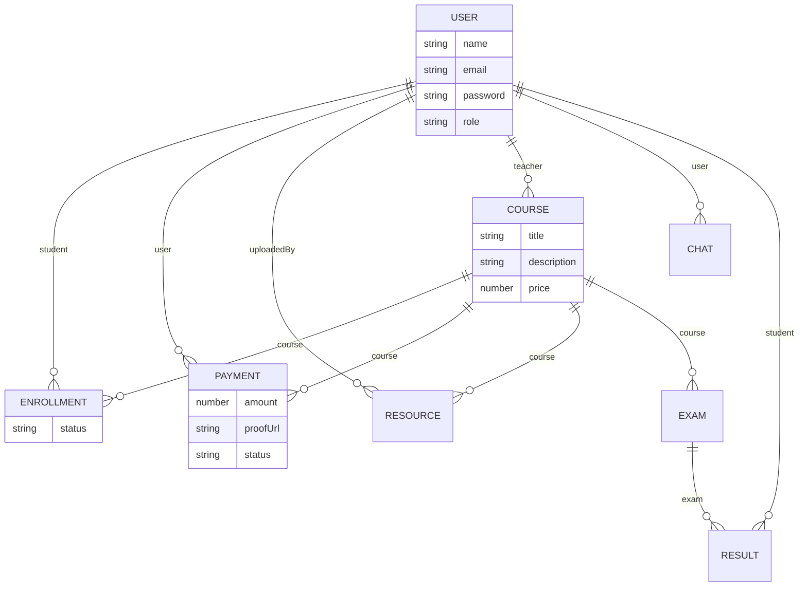

# Database Schema Diagram Details

The system uses a NoSQL document-based schema in MongoDB. Below are the primary collections and their relationships.

## Collections

### 1. User
- `name`: String
- `email`: String (Unique)
- `password`: String (Hashed)
- `role`: Enum (Student, Teacher, Admin)
- `profilePicture`: String (URL)

### 2. Course
- `title`: String
- `description`: String
- `teacher`: ObjectId (Ref User)
- `price`: Number
- `thumbnail`: String (URL)

### 3. Enrollment
- `student`: ObjectId (Ref User)
- `course`: ObjectId (Ref Course)
- `status`: Enum (Pending, Approved, Rejected)

### 4. Payment
- `user`: ObjectId (Ref User)
- `course`: ObjectId (Ref Course)
- `amount`: Number
- `proofUrl`: String (URL)
- `status`: Enum (Pending, Verified, Failed)

### 5. Resource
- `course`: ObjectId (Ref Course)
- `title`: String
- `fileUrl`: String (URL)
- `fileType`: String
- `uploadedBy`: ObjectId (Ref User)

### 6. Exam
- `course`: ObjectId (Ref Course)
- `title`: String
- `questions`: Array [{ question, options, correctAnswer }]
- `duration`: Number (Minutes)

### 7. Result
- `exam`: ObjectId (Ref Exam)
- `student`: ObjectId (Ref User)
- `score`: Number

### 8. Chat
- `user`: ObjectId (Ref User)
- `messages`: Array [{ sender, text, timestamp }]

---
## ER Diagram (Mermaid)
You can copy this code into [Mermaid Live Editor](https://mermaid.live/) to generate your PNG.

**Note to Team Leader**: Please visualize these relationships (e.g., ER Diagram) using a tool like Draw.io or screenshot the Mermaid diagram above and save it as `Database_Schema_Diagram.png`.
