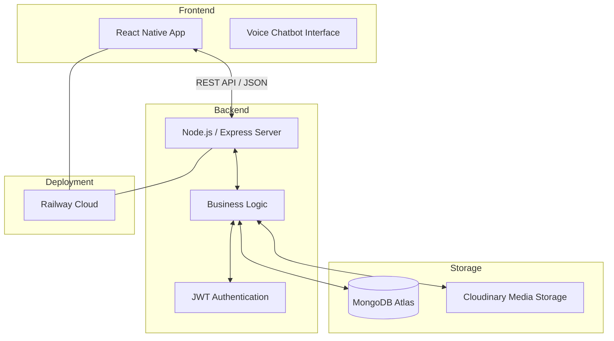

# System Architecture

The Learning Management System (LMS) follows a modern **Client-Server Architecture** designed for scalability and responsiveness.

## Architectural Components

### 1. Frontend (Mobile Client)
- **Technology**: React Native (Expo)
- **Responsibility**: Provides the user interface for Students, Teachers, and Admins. Handles voice/text chatbot interaction, course browsing, resource downloads, and exam participation.
- **Communication**: Interacts with the backend via RESTful APIs.

### 2. Backend (Server)
- **Technology**: Node.js + Express.js
- **Responsibility**: Implements business logic, handles authentication (JWT), processes chatbot queries, manages file uploads, and coordinates database operations.
- **Architecture**: Layered architecture (Routes -> Controllers -> Models).

### 3. Database
- **Technology**: MongoDB Atlas
- **Responsibility**: Stores persistent data including user profiles, course details, enrollments, payment records, resources, exams, and chat history.

### 4. External Services
- **Cloudinary**: Used for secure storage and management of media files (thumbnails, profile pictures, payment proofs).
- **Railway**: Cloud platform for hosting the backend server.
- **Google Fonts / Expo Fonts**: For typography and iconography.

---
## Visual Diagram (Mermaid)
You can copy this code into [Mermaid Live Editor](https://mermaid.live/) to generate your PNG.

**Note to Team Leader**: Please use a tool like Lucidchart, Draw.io, or screenshot the Mermaid diagram above and save it as `System_Architecture_Diagram.png`.
